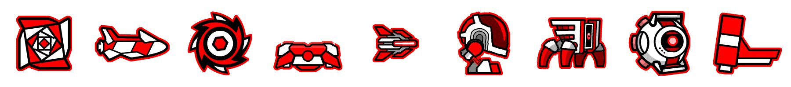
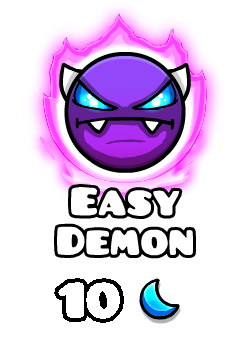

# JDash


[](https://central.sonatype.com/namespace/com.alex1304.jdash)

[](https://javadoc.io/doc/com.alex1304.jdash/jdash-client)

A reactive Geometry Dash API wrapper for Java.

## Overview

JDash is a multi-module library **requiring [JDK 17](https://adoptopenjdk.net/?variant=openjdk11&jvmVariant=hotspot) or above since version 5.0**. There are currently 4 modules.

### JDash Client module

Provides a high-level client to request data from Geometry Dash servers. It is powered by [Project Reactor](https://projectreactor.io) which allows to make requests in an efficient and non-blocking manner with backpressure handling (requests are queued internally and processed when resources are available, allowing requests to fail-fast in case the queue is full).

```java
GDClient client = GDClient.create();

// Block until request completes
GDLevel level = client.findLevelById(10565740).block();
System.out.println(level);

// But we can also choose to make it asychronous and non-blocking
client.getUserProfile(98006).subscribe(System.out::println); // will not block
```

Maven dependency:

```xml
<dependency>
    <groupId>com.alex1304.jdash</groupId>
    <artifactId>jdash-client</artifactId>
    <version>${version}</version> <!-- replace with latest version -->
</dependency>
```

### JDash Events module

Provides an event loop that can be subscribed to in order to periodically send requests with a `GDClient` and emit events when changes are detected on the server. It comes with default implementations that can detect when new levels or lists get rated, and when the Daily level or Weekly demon changes. You may also implement your own events with the `GDEventProducer` interface.

```java
GDClient client = GDClient.create();
GDEventLoop eventLoop = GDEventLoop.startWithDefaults(client);

eventLoop.on(AwardedAdd.class)
        .subscribe(event -> System.out.println("New level rated: "
                + event.addedLevel().name()));

eventLoop.on(DailyLevelChange.class)
        .subscribe(event -> System.out.println("New Daily level: "
                + event.after().name()));
```

Maven dependency:

```xml
<dependency>
    <groupId>com.alex1304.jdash</groupId>
    <artifactId>jdash-events</artifactId>
    <version>${version}</version> <!-- replace with latest version -->
</dependency>
```

### JDash Graphics module

Allows to generate player icons and level difficulty icons from game assets.

#### Example 1: Generate an arbitrary player icon

```java
IconRenderer renderer = IconRenderer.load(IconType.SPIDER, 15);
ColorSelection color = new ColorSelection(12, 9, OptionalInt.of(9));
BufferedImage output = renderer.render(color);
```


#### Example 2: Generate the full icon set of a `GDUserProfile`

```java
GDClient client = GDClient.create();
GDUserProfile user = client.getUserProfile(98006).block();
IconSetFactory factory = IconSetFactory.forUser(user);
BufferedImage output = factory.createIconSet();
```



#### Example 3: Generate an arbitrary difficulty icon

```java
BufferedImage image = DifficultyRenderer.create(DemonDifficulty.EASY)
        .withMoons(10)
        .withQualityRating(QualityRating.LEGENDARY)
        .render();
```



#### Example 4: Generate the difficulty icon of a `GDLevel`

```java
GDClient client = GDClient.create();
GDLevel level = client.findLevelById(10565740).block();
BufferedImage image = DifficultyRenderer.forLevel(level).render();
```


Maven dependency:

```xml
<dependency>
    <groupId>com.alex1304.jdash</groupId>
    <artifactId>jdash-graphics</artifactId>
    <version>${version}</version> <!-- replace with latest version -->
</dependency>
```

### JDash Common module

Contains utility classes and data types to encode the different entities of Geometry Dash (levels, users...) required by all other modules.

**If you are already using one of the other modules, you don't need to add this dependency as other modules transitively require it.**

```xml
<dependency>
    <groupId>com.alex1304.jdash</groupId>
    <artifactId>jdash-common</artifactId>
    <version>${version}</version> <!-- replace with latest version -->
</dependency>
```

## Documentation

The full documentation is available at: https://jdash.alex1304.com

Javadoc:
* For the common module: https://javadoc.io/doc/com.alex1304.jdash/jdash-common
* For the client module: https://javadoc.io/doc/com.alex1304.jdash/jdash-client
* For the events module: https://javadoc.io/doc/com.alex1304.jdash/jdash-events
* For the graphics module: https://javadoc.io/doc/com.alex1304.jdash/jdash-graphics

## License

This project is licensed under the MIT licence.

## Contribute

Have a feature to suggest or a bug to report ? Issues and pull requests are more than welcome! Make sure to follow the template and share your ideas.

## Contact

E-mail: mirandaa1304@gmail.com

Discord: Alex1304#9704

Twitter: @gd_alex1304
