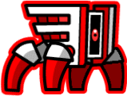
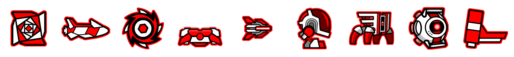
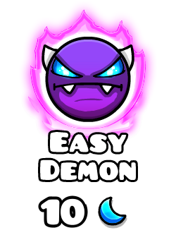
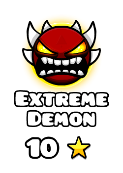

import Tabs from '@theme/Tabs';
import TabItem from '@theme/TabItem';

This section will cover the features of the JDash Graphics module.

## Installation

Add the Maven or Gradle dependency to your project as described below:

<Tabs
    groupId="build-tools"
    defaultValue="maven"
    values={[
        {label: 'Maven', value: 'maven'},
        {label: 'Gradle', value: 'gradle'},
    ]}>
<TabItem value="maven">

```xml
<dependency>
    <groupId>com.alex1304.jdash</groupId>
    <artifactId>jdash-graphics</artifactId>
    <version>${version}</version> <!-- replace with latest version -->
</dependency>
```

</TabItem>
<TabItem value="gradle">

```groovy
repositories {
    mavenCentral()
}

dependencies {
    // Replace ${version} with latest version
    implementation 'com.alex1304.jdash:jdash-graphics:${version}'
}
```

</TabItem>
</Tabs>

## Player icons

Generating player icons is possible using the `IconRenderer` class. The `load` method will load in-game assets corresponding to the chosen icon. You can select the color with a `ColorSelection` instance, that accepts a primary color, a secondary color and an optional glow color.

```java
IconRenderer renderer = IconRenderer.load(IconType.SPIDER, 15);
ColorSelection color = new ColorSelection(12, 9, OptionalInt.of(9));
BufferedImage output = renderer.render(color);
```

This code gives the following output:



:::tip
`BufferedImage` is a type from the Java Graphics API, you can for example save it to a file with `ImageIO.write()`:
```java
ImageIO.write(image, "png", new File("icon.png"));
```
:::

:::info
If you want to use default colors:
```java
ColorSelection color = ColorSelection.defaultColors(true); // true = show glow
```
:::

## Player icons for a `GDUserProfile`

If you have a `GDUserProfile`, you can use the `IconSetFactory` to conveniently generate icons for the user.

```java
GDClient client = GDClient.create();
GDUserProfile user = client.getUserProfile(98006).block();
IconSetFactory factory = IconSetFactory.forUser(user);
BufferedImage output = factory.createIconSet();
```



:::info
Use `factory.createIcon(IconType)` if you only want one of the icons instead of the whole set.
:::

## Difficulty icons

This module also supports generating difficulty icons for levels. The `DifficultyRenderer` class gives you a lot of flexibility to achieve that while still being simple to use.

```java
BufferedImage image = DifficultyRenderer.create(DemonDifficulty.EASY)
        .withMoons(10)
        .withQualityRating(QualityRating.LEGENDARY)
        .render();
```



:::warning
`withStars(int)`, `withMoons(int)` and `withDiamonds(int)` accept arbitrary values, including negative ones. Beware that the image may be truncated if the value exceeds 3 symbols.
:::

## Difficulty icon for a `GDLevel`

If you want the difficulty icon of a specific `GDLevel`, use the `DifficultyRenderer.forLevel(GDLevel)` method and directly call `render()` on the result:

```java
GDClient client = GDClient.create();
GDLevel level = client.findLevelById(10565740).block();
BufferedImage image = DifficultyRenderer.forLevel(level).render();
```

